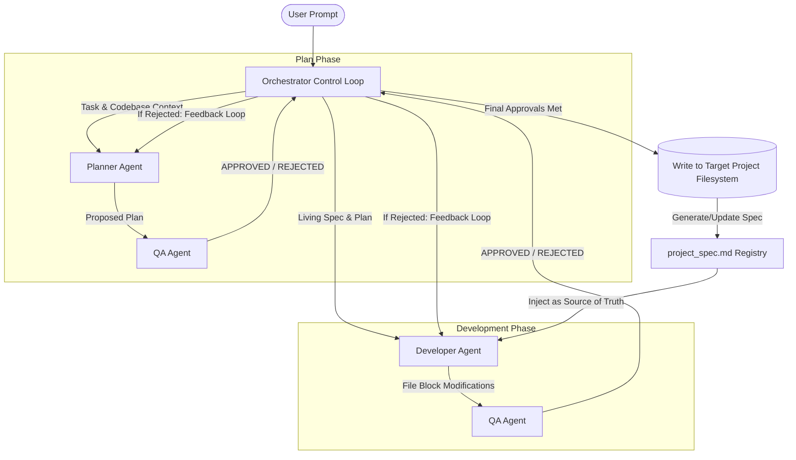

# Local LLM Multi-Agent Code Orchestrator

An autonomous, multi-agent software development pipeline designed to run entirely on **local open-weight LLMs** (using LM Studio, Ollama, or similar OpenAI-compatible local servers). 

The system implements a structured code-writing state machine featuring specialized agent roles (**Planner**, **Developer**, **QA**) orchestrated to safely update local codebases.

---

## Architecture & Workflow

The orchestrator manages data passing and execution states in a strict verification loop:



---

## Key Features

- **Local-First Inference**: Fully optimized for consumer-hardware-friendly models (e.g., Qwen 2.5 Coder 7B/14B, Gemma-2 9B, Unsloth Qwen 3.5 9B).
- **Living Project Spec & Interface Registry (`project_spec.md`)**: Dynamically generates and maintains a technical specification sheet of the codebase. At each step, the orchestrator updates this file with the public interface methods, classes, and properties introduced. This spec is fed back to the Developer as the single source of truth, drastically reducing token bloat and preventing interface mismatches.
- **Workflow State Checkpointing & Resumability**: Saves execution states after every approved sub-task. If the local LLM server crashes, runs out of memory, or gets interrupted, the orchestrator automatically resumes from the last completed checkpoint.
- **Search-and-Replace Parsing Fallback** *(New)*: Detects when git diff style SEARCH/REPLACE blocks fail due to minor spacing or indentation mismatches, automatically falling back to robust partial patch matching to write the code safely to disk without syntax loss.
- **Optimized Developer Prompts for Local LLMs** *(New)*: Restructures developer instructions to place the immediate sub-task as the primary header, demoting the overall project goal to bottom context. This keeps local 9B models strictly focused on the current step boundaries.
- **Aligned QA Rules & Flexibility** *(New)*: Enforces relaxed QA review rules for client-side sandboxed environments, permitting standard shortcuts like `eval()` and early feature completion (over-implementation) while accepting both search/replace blocks and full file submissions.
- **QA Deadlock Loop Override** *(New)*: A safety override that automatically approves changes on Iteration 3 if the code compiles cleanly and passes syntax checks, preventing pedantic QA loops from locking the workflow.
- **Flexible Partial Acceptance**: Parses and validates syntax for each generated code block independently. If a syntax error is detected, only that specific file block is rejected and sent back to the developer for correction, while valid file blocks are accepted and written immediately to prevent loop deadlocks.
- **Smart Model Mapping**: Automatically detects loaded models from your local endpoint and maps them to agent roles according to their capabilities.
- **XML-Based Code Extraction**: Developer outputs are captured in structured `<file path="...">` tags, allowing the Orchestrator to securely parse, create, or overwrite files without manual developer intervention.
- **Self-Healing Loop**: If the QA agent rejects a plan or implementation, the Orchestrator automatically pipes the specific feedback back to the respective agent for corrections (up to a configurable maximum of 5 iterations).
- **Legacy Python Monkeypatching**: Built-in runtime patch (`patch_env.py`) to run modern libraries (like `openai`, `pydantic`, `anyio`) on legacy or early Python alpha environments (such as Python 3.10.0a3) by resolving missing standard library types and dataclass keyword arguments.

---

## Project Structure

```
├── agents/
│   ├── __init__.py
│   ├── base.py          # OpenAI client wrapper & model auto-detection
│   ├── planner.py       # Architecture planner agent
│   ├── developer.py     # Code-generation agent
│   └── qa.py            # Code & plan reviewer agent
├── config.py            # Local endpoint and ignore directories config
├── patch_env.py         # Critical Python compatibility patches
├── orchestrator.py      # Core state loop, parser, and file writer
├── main.py              # Beautiful CLI wrapper using 'rich'
├── requirements.txt     # Project dependencies (openai, rich)
└── README.md            # Project documentation
```

---

## Getting Started

### 1. Prerequisites

- **Python**: 3.7+ (Fully tested on early Python 3.10 alphas)
- **Local LLM Server**: Start [LM Studio](https://lmstudio.ai/) or [Ollama](https://ollama.com/) with the local server running on `http://localhost:1234/v1` (or change `API_BASE_URL` in `config.py`).
- **Load Models**: Make sure you have coding/instruct models loaded (e.g., `qwen2.5-coder-7b-instruct`, `qwen3.5-9b`).

### 2. Installation

Clone the repository and install the dependencies:

```bash
pip install -r requirements.txt
```

### 3. Usage

Run the CLI orchestrator to modify code in a target directory:

```bash
python main.py --target-dir /path/to/your/project --prompt "Implement a clear button in calculator.py"
```

If you run `python main.py` without arguments, it will interactively prompt you for a task description and default to writing inside `./target_workspace`.

## Verification & Demonstration

The system was verified by building a full-featured **Retro Game Cabinet** with audio, CRT effects, and multiple playable games (Snake and Pong):
1. **Goal**: Create a web-based Retro Game Cabinet featuring functional Web Audio synthesizers, classic retro physics, collision handling, and loop synchronization.
2. **Attract Mode & Living Specs**: On boot, the orchestrator generated a `project_spec.md` listing the retro audio, keyboard, and viewport bounds, allowing the 9B model to seamlessly map coordinate loops between the independent classes.
3. **Outcome**: The self-healing loop caught and fixed browser focus bugs and audio context suspension traps, resulting in a fully working, responsive cabinet.
