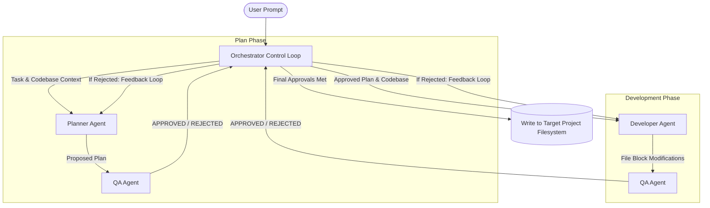

# Local LLM Multi-Agent Code Orchestrator

An autonomous, multi-agent software development pipeline designed to run entirely on **local open-weight LLMs** (using LM Studio, Ollama, or similar OpenAI-compatible local servers). 

The system implements a structured code-writing state machine featuring specialized agent roles (**Planner**, **Developer**, **QA**) orchestrated to safely update local codebases.

---

## Architecture & Workflow

The orchestrator manages data passing and execution states in a strict verification loop:



---

## Features

- **Local-First Inference**: Fully optimized for consumer-hardware-friendly models (e.g., Qwen 2.5 Coder 7B/14B, Gemma-2 9B).
- **Smart Model Mapping**: Automatically detects loaded models from your local endpoint and maps them to agent roles according to their capabilities:
  - **Planner Agent**: Uses larger coder models (e.g., `qwen-14b-coder`) for structured technical blueprints.
  - **Developer Agent**: Uses fast coder models (e.g., `qwen-7b-instruct`) optimized for code generation.
  - **QA Agent**: Uses larger reasoning/instruction-tuned models (e.g., `qwen-9b` or `gemma-9b`) to review plan safety, check syntax, and enforce design constraints.
- **XML-Based Code Extraction**: Developer outputs are captured in structured `<file path="...">` tags, allowing the Orchestrator to securely parse, create, or overwrite files without manual developer intervention.
- **Self-Healing Loop**: If the QA agent rejects a plan or implementation, the Orchestrator automatically pipes the specific feedback back to the respective agent for corrections (up to a configurable maximum of 5 iterations).
- **Legacy Python Monkeypatching**: Built-in runtime patch (`patch_env.py`) to run modern libraries (like `openai`, `pydantic`, `anyio`) on legacy or early Python alpha environments (such as Python 3.10.0a3) by resolving missing standard library types and dataclass keyword arguments.

---

## Project Structure

```
├── agents/
│   ├── __init__.py
│   ├── base.py          # OpenAI client wrapper & model auto-detection
│   ├── planner.py       # Architecture planner agent
│   ├── developer.py     # Code-generation agent
│   └── qa.py            # Code & plan reviewer agent
├── config.py            # Local endpoint and ignore directories config
├── patch_env.py         # Critical Python compatibility patches
├── orchestrator.py      # Core state loop, parser, and file writer
├── main.py              # Beautiful CLI wrapper using 'rich'
└── requirements.txt     # Project dependencies (openai, rich)
```

---

## Getting Started

### 1. Prerequisites

- **Python**: 3.7+ (Fully tested on early Python 3.10 alphas)
- **Local LLM Server**: Start [LM Studio](https://lmstudio.ai/) or [Ollama](https://ollama.com/) with the local server running on `http://localhost:1234/v1` (or change `API_BASE_URL` in `config.py`).
- **Load Models**: Make sure you have coding/instruct models loaded (e.g., `qwen2.5-coder-7b-instruct`).

### 2. Installation

Clone the repository and install the dependencies:

```bash
pip install -r requirements.txt
```

### 3. Usage

Run the CLI orchestrator to modify code in a target directory:

```bash
python main.py --target-dir /path/to/your/project --prompt "Implement a clear button in calculator.py"
```

If you run `python main.py` without arguments, it will interactively prompt you for a task description and default to writing inside `./target_workspace`.

## Verification & Demonstration

The system was verified by implementing an HTTP Web Server Log Analyzer:
1. **Goal**: Create a mock log generator producing Apache/Nginx Combined Log Format files and an analyzer to parse, collect metrics, save JSON reports, and print console stats.
2. **Execution**: The local QA agent successfully **rejected** early drafts because the planner generated invalid IP ranges (`0.x.x.x` and `256.x.x.x`) and didn't support `-` placeholders in bytes-sent metrics, which would crash real-world log parsers.
3. **Outcome**: The feedback loops resolved all QA issues, resulting in clean, robust code for `log_generator.py` and `log_analyzer.py` inside the local `test_target_project` workspace.
