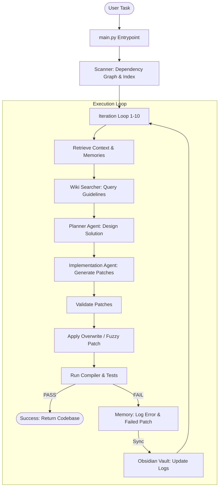

# Local LLM Agent Coding Orchestrator

A local-first, single-LLM autonomous agent orchestrator that resolves coding tasks, applies file patches, and validates changes using a feedback-driven test execution loop. Optimized to run on consumer GPUs using OpenAI-compatible local servers like **LM Studio**, **Ollama**, or **llama.cpp**.

---

## 🛠️ Unified System Flow



---

## ✨ Key Features

* **Dual-Format Patch Engine:** Supports both targeted `SEARCH/REPLACE` blocks and full-file `OVERWRITE ALL` blocks. Uses fuzzy regex whitespace matching to tolerate minor indentation fluctuations in smaller (9B/7B) parameter coder models.
* **Obsidian Vault Memory Sync:** Automatically syncs execution history, success diffs, and error diagnostics directly into an Obsidian vault (`obsidian_vault/`). Auto-generates local wiki-links (`[[Project Index]]`, `[[Learnings]]`) to build a visual knowledge graph of agent activities.
* **LLM Wiki Guidelines (RAG):** Scans the `obsidian_vault/Wiki/` directory for developer rules matching task keywords (e.g. `LocalStorage.md`, `Coding_Guidelines.md`). Automatically injects rules into the prompt to guide the LLM's architecture choices.
* **Safe Path Parsing:** Normalizes target folder suffixes to prevent LLMs from outputting duplicate nested directories.
* **Fake-Agent Testing:** Includes a sandbox target directory and dry-run scripts to verify multi-file generation cycles without calling model API servers.

---

## 📂 Project Structure

```text
local-agent-workflow/
├── src/
│   ├── main.py            # Entrypoint parsing target project and task
│   ├── agents/
│   │   ├── planner.py     # Solves tasks and produces step checklists
│   │   └── implementation.py # Writes git-diff / overwrite patches
│   ├── core/
│   │   ├── controller.py  # Orchestrates iteration loops and feedback
│   │   ├── memory.py      # Logs state and outputs Obsidian markdown diaries
│   │   ├── wiki.py        # Keyword RAG retriever for LLM developer rules
│   │   ├── llm.py         # Standard library HTTP client calling local API
│   │   └── config.py      # Local environment configuration
│   ├── indexer/
│   │   ├── scanner.py     # Generates target project manifests
│   │   ├── retriever.py   # Extracts codebase context files
│   │   └── symbol_parser.py # Builds symbol indexing tables
│   ├── patcher/
│   │   └── validator.py   # Validates patch structure syntax
│   └── runner/
│       ├── compiler.py    # Executes target build scripts
│       └── tester.py      # Runs target test suites and captures failures
├── obsidian_vault/        # Synced Obsidian notes (Projects, Learnings, Wiki)
└── test_target_project/   # Sandbox target directory for local development checks
```

---

## 🚀 Setup & Installation

1. **Clone the repository** and install dependencies:
   ```bash
   pip install -r requirements.txt
   ```

2. **Configure your Local LLM Server:**
   * Open **LM Studio** or **Ollama** and load a coding model (e.g., `qwen2.5-coder` or `qwen3.5-9b`).
   * By default, the client expects the local endpoint at `http://localhost:1234/v1` (LM Studio's default). Override this in `src/core/config.py` if needed.
   * **VRAM Tip:** Keep context capped at `12k` to `16k` in your server settings to avoid VRAM spillover and maintain rapid (>30 t/s) decoding speeds.

---

## 🕹️ Usage

To launch the agent loop on a target repository:

```bash
python src/main.py <target_directory_path> "<detailed_task_description>"
```

### Example:
```bash
python src/main.py ../my-web-app "Add an interactive search bar in index.html, style it in style.css, and handle input keypress event listeners in src/main.js. Persist search queries in localStorage."
```

---

## 🧠 Managing the LLM Wiki

To prevent the agent from repeating common mistakes (e.g., writing invalid f-strings, forgetting UI buttons, or failing state parsing):
1. Open the `obsidian_vault` directory inside your **Obsidian Desktop Client**.
2. Create or edit notes inside the `Wiki/` folder (e.g. `Wiki/LocalStorage.md`).
3. Write your architectural guidelines or code templates.
4. When you execute tasks, the agent will query and implement these guidelines automatically!
